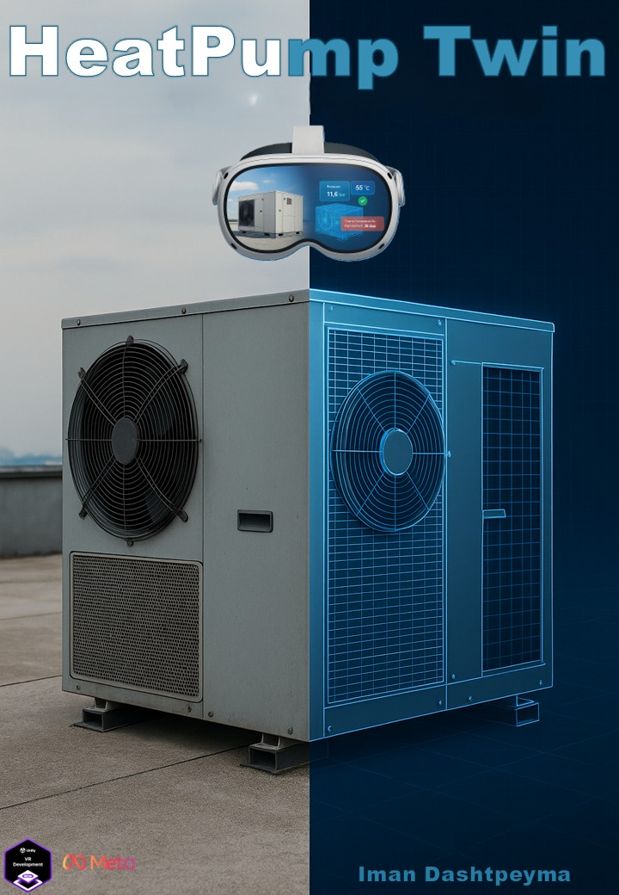
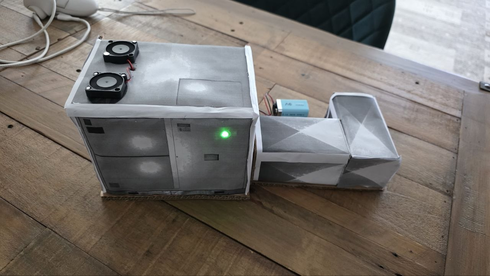

# HeatPumpTwin V3
### Mixed Reality Digital Twin for Guided HVAC Training with Physical Hardware Integration

> **Course:** Design for Complex and Dynamic Contexts (DCDC 2025/2026)
> **Author:** Iman Dashtpeyma
> **Supervisors:** Jordi Solsona Belenguer, Charles Windlin

---

<p align="center">
  
</p>

## Introduction

HeatPumpTwin V3 is a collaborative Mixed Reality (MR) digital twin prototype designed to support guided, role-based HVAC configuration training in a shared physical and digital space.

This version extends V2 with two key additions. The first is **real physical colocation**: the Engineer and Technician's headsets automatically align to the same physical space using Meta's native Shared Spatial Anchors, so the shared digital twin appears in the same real-world spot for both. The second is a **physical hardware prototype**: a cardboard-scale HVAC model embedded with an Arduino UNO R4 WiFi that responds in real time to approval decisions made inside the MR environment via MQTT. When the Engineer approves a configuration change, the physical model responds immediately: the LED turns green, the fans spin, and the buzzer confirms. Proposed and rejected states are reflected too.

V3's scenario has the Engineer, an experienced professional, using the shared MR space to teach and guide a new Technician through HVAC configuration. Both users are physically colocated, in the same room, wearing Meta Quest 3 headsets, sharing both the physical HVAC model and the digital twin overlaid on their real environment.

---

## What's New in V3

| Area | V2 | V3 |
|---|---|---|
| Networking | Photon PUN 2 | Photon Fusion 2 (Shared Mode) |
| Colocation | None (each user saw shared objects at a different physical spot) | Real colocation via Meta's native Shared Spatial Anchors / Colocation Building Block, confirmed working across two headsets |
| Object sync | One-time position snapshot on spawn, no live transform sync | Continuous networked transforms (`NetworkTransform`), including hand-grabbed objects |
| Scenario | Generic collaborative configuration | Engineer teaches Technician |
| Parameter review | Not synced live | Technician's parameter edits (power/pressure/phase) mirror to the Engineer's panel live, before Propose is even pressed |
| Physical hardware | None | Arduino UNO R4 WiFi + fans + LED + buzzer |
| IoT integration | Simulated | MQTT over WiFi (test.mosquitto.org) |
| Hardware response | None | LED, fans, and buzzer reflect the Off/Suspended/Approved/Rejected state |
| Physical model | None | Cardboard-scale HVAC model with embedded electronics |

---

## Project Goal

HeatPumpTwin V3 explores how a shared Mixed Reality digital twin, actually colocated between physically present users and connected to real physical hardware, can support guided HVAC training between an experienced Engineer and a new Technician.

The project investigates how two users physically sharing the same space can:

- see a shared digital twin appear in the same real-world spot on both headsets
- inspect that twin overlaid on a physical HVAC model
- propose and review configuration changes through role-based interaction, with live visibility into what's being proposed
- receive immediate physical feedback when a configuration is approved or rejected
- experience the connection between digital decisions and real hardware response

---

## Scenario

An Engineer and a Technician are physically in the same room. Both wear Meta Quest 3 headsets. A cardboard-scale HVAC model sits between them, containing a real Arduino, fans, LEDs, and a buzzer.

The Engineer uses the MR environment to guide the Technician through the configuration process. The Technician proposes changes. The Engineer reviews them, seeing the exact values being proposed live as the Technician adjusts them. When the Engineer approves, the physical hardware responds, not just the UI. This makes the learning moment tangible, immediate, and memorable.

### Interaction Flow

1. Both headsets automatically colocate at session start (native Shared Spatial Anchors); no manual alignment step is needed.
2. The Engineer selects a spatial location using map pins; a virtual heat pump appears half a meter in front of them, on the floor.
3. The HVAC starts **Off** (red LED, fans stopped), since it hasn't been proposed, approved, or rejected yet.
4. The Technician adjusts operational parameters (power, pressure, phase); each change appears live on the Engineer's panel too.
5. The Technician presses **Propose**, and the system enters **Suspended**: LED turns blue, fans off, buzzer signals, and the proposed values are sent to the physical Arduino.
6. The Engineer reviews the proposed configuration (visible in their own panel) and either:
   - **Approves**: LED turns green, fans spin, buzzer double-beeps, on both headsets and the physical model.
   - **Rejects**: LED turns red, fans stay off, buzzer plays descending tones, on both headsets and the physical model.

The physical hardware response makes the approval decision visible not just in MR, but in the real world.

---

## Design Process

### Design Goals

- Make colocation actually work. Both users seeing the shared digital twin in the same physical spot was a core requirement, not an assumption.
- Support real-time guided training between Engineer and Technician in a colocated MR environment
- Make the connection between digital decisions and physical hardware response visible and immediate
- Reflect a realistic industrial workflow: propose, validate, apply
- Use the physical model to make the digital twin tangible for the Technician

### Challenges

- Getting native Shared Spatial Anchor colocation actually working on-device: Bluetooth discovery, Meta Quest Developer Hub entitlement (a full release-channel plus user-invite flow is required; sideloading alone is not enough), and Meta's Colocation Building Block components needing to be present in the scene
- Making Fusion's `NetworkTransform` and Meta's Interaction SDK grab system cooperate. A grabbed networked object's moved position has to be fed into Fusion's own simulation tick to actually replicate, not just set on the visual transform.
- Keeping a blocking MQTT connection attempt from ever freezing the app (and silently killing the Fusion session) when the broker is slow or unreachable
- Synchronizing MR state changes, including live, not-yet-submitted parameter edits, with physical hardware in real time
- Designing hardware response patterns that are distinct and immediately understandable
- Balancing simplicity of interaction with meaningful feedback across both the digital and physical layer

### Solution

- Migrated networking from Photon PUN 2 to Photon Fusion 2 (Shared Mode)
- Adopted Meta's official Colocation, Network Manager, Custom/Local Matchmaking, and Shared Spatial Anchor Building Blocks instead of a manual alignment hack
- Role-based MR workflow (Technician proposes and can watch the Engineer's live acknowledgment; Engineer validates)
- MQTT bridge from Unity to Arduino over WiFi, running its socket work off the main thread
- Arduino hardware responds to `selected`, `suspended`, `approved`, and `rejected` messages
- Distinct hardware states: LED color, buzzer tone, and fan state per stage

---

## Digital Twin Concept

The digital twin in V3 represents:

- a virtual HVAC heat pump, colocated for both users and anchored near the physical cardboard model
- parameter states, power, pressure, and phase, kept in sync between both users the moment either one edits them
- status transitions: **Off → Suspended → Approved** or **Off → Suspended → Rejected**
- real-time synchronization across both connected MR users, including hand-grabbed object transforms
- **physical state mirroring**: the cardboard model reflects digital state via MQTT

The twin functions as both a collaborative decision interface and a training tool. The physical hardware layer closes the loop between digital action and real-world consequence.

---

## Collaboration and Colocation

### Physical Colocation

Both the Engineer and the Technician are physically in the same room. They share:

- the same physical space, aligned automatically via Meta's Shared Spatial Anchors at session start
- the same MR overlay (Meta Quest 3)
- the same physical HVAC model
- the same digital twin state and position: grabbing and moving the shared Map on one headset is visible on the other

The Engineer can point to the physical model while adjusting the digital twin. The Technician can see both the MR interface and the hardware respond to the same action.

### Multi-User Synchronization

- Photon Fusion 2 (Shared Mode) networking
- Native Meta colocation via Shared Spatial Anchors (Colocation Building Block), not a manual calibration step
- RPC-based state updates for pin selection, parameter proposal/live edits, approval, and rejection
- Continuous `NetworkTransform` sync for shared objects, including ones grabbed and moved by hand

### Role-Based Control

- The Technician proposes configuration changes, visible live to the Engineer as they're made
- The Engineer reviews and approves or rejects
- The approval workflow enforces structured learning, not just safety

---

## Physical Hardware Integration

### Hardware Components

| Component | Model | Purpose |
|---|---|---|
| Microcontroller | Arduino UNO R4 WiFi | WiFi + MQTT client |
| RGB LED | Common cathode | Visual state indicator |
| Relay module | TONGLING JQC-3FF-S-Z (5V) | Fan control (avoids exceeding 40mA pin limit) |
| DC Fans (×2) | LD3007MS 5V / 0.2A | Physical airflow feedback |
| Passive Buzzer | n/a | Audio feedback per state |

### Pin Mapping

| Pin | Component |
|---|---|
| 12 | LED Red |
| 11 | LED Green |
| 10 | LED Blue |
| 7 | Relay (fan control) |
| 9 | Passive Buzzer |

### MQTT Configuration

- **Broker:** `test.mosquitto.org`
- **Port:** `1883`
- **Topic:** `hvac/heatpumptwin/iman2026`

### Hardware State Behavior

| MQTT Message | Sent when | LED | Fans | Buzzer |
|---|---|---|---|---|
| `selected` | Engineer picks a pin on the Map (spawns the hologram) | *(unchanged)* | *(unchanged)* | One short tone |
| `suspended` | Technician presses Propose | 🔵 Blue | Off | One long low tone |
| `approved` | Engineer approves | 🟢 Green | On | Two short high beeps |
| `rejected` | Engineer rejects | 🔴 Red | Off | Three descending tones |
| Startup | Arduino boots and connects | 🟢 Green | On (default running state) | Three ascending notes |

In MR, the HVAC's own indicator additionally shows **red** the moment it's spawned (before any Propose), matching the Rejected color. Both mean "not currently running."

### Physical Model

<p align="center">
  
  &nbsp;
  
</p>
<p align="center"><em>Physical cardboard HVAC model, front and back, with embedded Arduino, fans, LED, and buzzer</em></p>

### Why a Relay Instead of Direct Pin Control?

The DC fans draw 200mA each. Arduino digital output pins are limited to 40mA. Driving the fans directly would damage the board. The relay module acts as a switch: the Arduino controls the relay with a safe signal current, and the relay switches the fan circuit independently.

---

## Features

- Real, native colocation between Meta Quest 3 headsets (Shared Spatial Anchors), with no manual calibration step
- Real-time multi-user MR collaboration with continuously synced object transforms, including hand-grabbed objects
- Shared digital twin visualization anchored to a physical model
- Role-based guided training workflow (Engineer ↔ Technician) with live parameter visibility
- Parameter editing for HVAC configuration (power, pressure, phase)
- Approval and rejection logic with physical hardware response
- MQTT bridge from Unity to Arduino over WiFi, non-blocking so a slow/unreachable broker can't freeze the app
- LED, fan, and buzzer feedback reflecting the Off/Suspended/Approved/Rejected state
- Photon Fusion-based synchronized state updates across MR clients
- Hand-tracked interaction in mixed reality (grab, poke)
- Spatially anchored asset selection using map pins

---

## Technical Implementation

### Software Stack

| Technology | Version | Purpose |
|---|---|---|
| Unity | 2022.3.62f2 (URP) | Core development platform |
| Meta XR SDK | 201.0.0 | MR, hand tracking, passthrough, colocation Building Blocks |
| Photon Fusion 2 | Shared Mode | Multi-user networking |
| Meta Interaction SDK | (bundled with Meta XR SDK) | Hand grab and poke interaction |
| OpenXR | n/a | XR runtime |
| ArduinoMqttClient | n/a | MQTT client on Arduino |
| WiFiS3 | n/a | WiFi on Arduino UNO R4 |

### Architecture Overview

```
[Meta Quest 3, Engineer]           [Meta Quest 3, Technician]
        |                                       |
        |     Meta Colocation Building Block    |
        |   (Shared Spatial Anchors, Bluetooth   |
        |         / WiFi proximity discovery)    |
        └──────────── Photon Fusion 2 ───────────┘
                    (Shared Mode, NetworkTransform)
                           |
                    Unity MQTT Client
                    (background-thread connect)
                           |
               test.mosquitto.org:1883
                           |
                    Arduino UNO R4 WiFi
                    (topic: hvac/heatpumptwin/iman2026)
                           |
              ┌────────────┼────────────┐
            RGB LED      Relay        Buzzer
                           |
                        Fans ×2
```

### Key Scripts

- `AppController`: hooks into the `NetworkRunner` started by Meta's Colocation Building Blocks, resolves the local Engineer/Technician role, and spawns the shared Map once colocation is actually ready (`ColocationController.ColocationReadyCallbacks`)
- `TwinNetworkHub`: synchronized digital twin state, covering pin selection, live parameter edits, propose/approve/reject, and HVAC spawn position/rotation
- `PinButton`: computes where the HVAC should appear (on the floor, near whoever's holding the Map) and its facing rotation
- `GrabAuthority`: requests Fusion state authority on grab and re-applies the grabbed pose inside `FixedUpdateNetwork()` so it actually replicates, not just the local visual transform
- `HVACIndicator` / `FanSpinner`: drive the LED color and fan spin from the current Off/Suspended/Approved/Rejected state
- `RoleUIManager`: shows the Engineer's or Technician's settings panel based on the resolved role
- `ProposeFromUI` / `ValueStepper`: parameter input UI that broadcasts each edit live to the other headset
- `MQTTManager`: publishes `selected` / `suspended` / `approved` / `rejected` to the Arduino, connecting on a background thread so a slow broker can't freeze the app

RPC methods control pin selection, live parameter edits, propose, approval, rejection, and MQTT publish.

---

## Installation and Setup

### Prerequisites

- Unity Hub
- Unity **2022.3.62f2**
- Two Meta Quest 3 headsets in Developer Mode with USB Debugging enabled (one is enough to test spawning/UI; colocation itself needs two)
- Bluetooth enabled on both headsets (required for colocation discovery)
- A Meta Horizon Developer Dashboard app with **User ID** and **User Profile** Data Use Checkup approved, and a release channel (e.g. Alpha) with every test account invited as a **Meta Quest User**. Sideloading the APK alone is not enough for the colocation entitlement check to pass.
- Git
- Photon Fusion 2 App ID
- Arduino IDE (for Arduino setup)
- Arduino UNO R4 WiFi with required components

### Clone Repository

```bash
git clone https://github.com/ImanDashtpeyma/DCDC25-HeatPumpTwin-V3
cd DCDC25-HeatPumpTwin-V3
```

---

### Unity Setup

#### 1. Open in Unity Hub

Open the cloned folder using Unity Hub. Make sure the project uses **Unity 2022.3.62f2**.

#### 2. XR Configuration

Before running, confirm these settings are enabled:

- **OpenXR** under XR Plug-in Management
- **Meta Quest support**
- **Hand Tracking** in Meta XR settings
- **Shared Spatial Anchor Support** set to Supported, and **Colocation Session Support** set to Required, on OVR Manager
- **Android** as the build platform
- Passthrough / MR permissions on the headset
- Main scene in **Scenes in Build**: `Assets/Scenes/Main.unity`

#### 3. Photon Fusion Setup

- Obtain a **Fusion App ID** from the [Photon Dashboard](https://dashboard.photonengine.com/)
- Set it in `Assets/Photon/Fusion/Resources/PhotonAppSettings.asset`
- Confirm the scene's `[BuildingBlock] Network Manager`, `Custom Matchmaking`, `Local Matchmaking`, `MR Utility Kit`, and `Colocation` objects are present (Meta → Tools → Building Blocks if any are missing)
- Confirm `FusionColocationDriver` and `Shared Spatial Anchor Core` are present in the scene. These can silently fail to install with the rest of the Colocation Building Block and must be added manually if missing.

#### 4. Meta Platform / Entitlement Setup

Real colocation needs the Meta Platform SDK's entitlement check to succeed, which needs more than an installed APK:

1. Set the app's Platform SDK App ID under `Meta → Platform → Edit Settings`
2. Sign the build with a release keystore
3. Upload the signed build to a release channel (e.g. Alpha) on the Meta Horizon Developer Dashboard
4. Invite every test account as a **Meta Quest User** member of that channel
5. Only then will `Package ... not in users library`-style entitlement failures go away

#### 5. Run Single-User Test

- Open `Assets/Scenes/Main.unity`
- Build and run on a single headset to confirm role resolution, Map spawn, and HVAC spawn/UI all work before testing colocation itself

#### 6. Two-Headset Colocation Testing

- Install the same build on both headsets, launched standalone (not via Quest Link/Air Link; the Fusion session must see the real installed app, not the streaming client)
- Both headsets need Bluetooth on and need to be near each other
- The first headset to start becomes the Engineer (Shared Mode master client); the second becomes the Technician
- Both must use the same Fusion App ID and be entitled on the same release channel

---

### Arduino Setup

#### 1. Install Arduino IDE Libraries

In the Arduino IDE, install:

- `ArduinoMqttClient` (by Arduino)
- `WiFiS3` (included with Arduino UNO R4 board package)

Install the UNO R4 board package via **Tools → Board → Boards Manager** (search: `Arduino UNO R4`).

#### 2. Configure WiFi and MQTT

Open `Arduino/HitPumpTwin/HitPumpTwin.ino` and update:

```cpp
const char* WIFI_SSID = "your_wifi_name";
const char* WIFI_PASS = "your_wifi_password";
```

The broker and topic are pre-configured:

```cpp
const char* BROKER = "test.mosquitto.org";
const int   PORT   = 1883;
const char* TOPIC  = "hvac/heatpumptwin/iman2026";
```

#### 3. Wire the Hardware

| Arduino Pin | Component |
|---|---|
| 12 | LED Red (with resistor) |
| 11 | LED Green (with resistor) |
| 10 | LED Blue (with resistor) |
| 7 | Relay module signal (S pin) |
| 9 | Passive Buzzer |
| GND | LED cathode, Relay GND, Buzzer GND |
| 5V | Relay VCC, Fan power (via relay) |

#### 4. Upload Sketch

- Select **Board:** Arduino UNO R4 WiFi
- Select the correct **Port**
- Click **Upload**
- Open Serial Monitor at **9600 baud** to verify WiFi and MQTT connection

On successful startup, the buzzer plays three ascending notes and the unit defaults to running (green, fans on).

---

## Usage

### Full Workflow

1. Power on the Arduino and confirm it connects (Serial Monitor shows `✅ WiFi!` and `✅ MQTT!`).
2. Start the Unity app on both headsets. They colocate automatically over Bluetooth/WiFi, with no manual alignment step.
3. The Engineer selects a location using a map pin. The virtual HVAC twin appears on the floor nearby (red LED, Off) and the Arduino beeps once.
4. The Technician adjusts parameters (power, pressure, phase). The Engineer sees each change live on their own panel.
5. The Technician presses **Propose**, and the system enters **Suspended**: both headsets' LEDs turn blue, and the Arduino receives `suspended` (blue, fans off, one long tone).
6. The Engineer reviews the proposal (seeing the exact proposed values) and guides the Technician on the reasoning.
7. If **approved**, both headsets' LEDs turn green, the fans spin in MR, and the Arduino receives `approved` (green, fans on, double-beep).
8. If **rejected**, both headsets' LEDs turn red, and the Arduino receives `rejected` (red, fans off, descending tones).
9. State syncs across both connected MR users throughout.

---

## Demo and Media

- **Video:** [Watch the demo video](https://drive.google.com/file/d/14ErgwlhwLzNp9T4oNFWZBnRtnHiqfCYw/)
- **V2 Repository:** [HeatPumpTwin V2](https://github.com/ImanDashtpeyma/DCDC25-HeatPumpTwin-V2)
- **Poster:** [View poster](https://github.com/ImanDashtpeyma/DCDC25-HeatPumpTwin-V2/blob/main/Poster-Video/HeatPump-Poster.jpg)

---

## References

### Assets and Libraries

| Resource | Purpose | License / Link |
|---|---|---|
| Unity 2022.3 URP | Core development platform | Unity License |
| Meta XR SDK 201.0.0 | MR, hand tracking, passthrough, colocation Building Blocks | Meta License |
| Photon Fusion 2 | Multi-user networking, Shared Mode | [Photon Engine](https://www.photonengine.com/fusion) |
| ArduinoMqttClient | MQTT client on Arduino | Arduino License |
| WiFiS3 | WiFi for Arduino UNO R4 | Arduino License |
| VR Interaction Framework | Base interaction utilities | Asset Store License |
| Rooftop AC HVAC Unit | 3D model for MR environment | [Asset Store](https://assetstore.unity.com/packages/3d/props/industrial/rooftop-ac-hvac-unit-315763) |

---

## Known Limitations

- The MQTT broker (`test.mosquitto.org`) is public and unencrypted, so it is not suitable for production use
- Cloud HVAC data is simulated; the prototype does not connect to a live HVAC backend
- The physical model is a proof-of-concept at cardboard scale
- Testing was conducted with two clients; behavior with more than two has not been verified
- The system supports one HVAC asset type
- No networked avatar/hand presence yet: each user sees the shared objects and hologram, but not a representation of the other person
- Poke buttons can occasionally register a single physical press as more than one Select event. This is harmless for idempotent actions like Reject, but Propose can log its value twice.

## Future Work

- **Avatar Presence**: add networked head/hand representation so each user can see where the other is
- **Data Richness**: integrate real telemetry and maintenance records
- **Asset Support**: expand to multiple HVAC asset types
- **UI Optimization**: improve panel layout for faster parameter editing in MR
- **Secure MQTT**: replace public broker with authenticated, encrypted endpoint
- **Scale**: transition from cardboard model to industrial-grade physical prototype

---

## Contributor and Maintainer

**Author and Maintainer:** Iman Dashtpeyma
**Course:** Design for Complex and Dynamic Contexts (DCDC 2025)
**Institution:** Stockholm University, DSV

**Supervisors**
- Jordi Solsona Belenguer
- Charles Windlin

---

## License

MIT License © 2025 Iman Dashtpeyma

Supervised by Jordi Solsona Belenguer and Charles Windlin
Stockholm University, DSV
